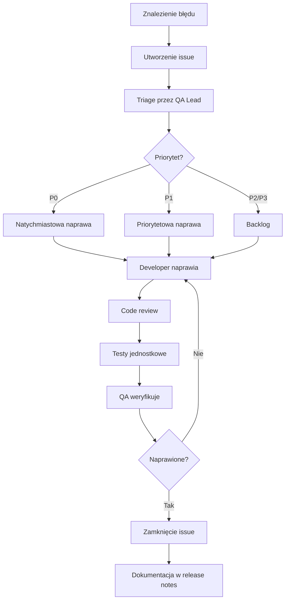

# Plan Testów dla Projektu Smart Flashcards

## Wprowadzenie i Cele Testowania

### Cel Główny
Celem testowania jest zapewnienie wysokiej jakości, niezawodności i bezpieczeństwa aplikacji Smart Flashcards - webowej platformy do automatycznego generowania fiszek z notatek tekstowych przy użyciu sztucznej inteligencji.

### Cele Szczegółowe
- Weryfikacja poprawności implementacji architektury Clean Architecture z podziałem na warstwy Data, Domain i Presentation
- Walidacja integracji z zewnętrznymi serwisami (Supabase, OpenRouter AI)
- Potwierdzenie poprawności zarządzania stanem aplikacji przy użyciu BLoC/Cubit
- Weryfikacja funkcjonalności CRUD dla talii i fiszek
- Zapewnienie wysokiej jakości generowania fiszek przez AI
- Testowanie responsywności interfejsu użytkownika

## Zakres Testów

### Obszary Objęte Testami

#### 1. Moduł Uwierzytelniania (`features/auth`)
- Rejestracja nowych użytkowników
- Logowanie użytkowników
- Wylogowanie
- Zarządzanie sesją użytkownika
- Obsługa błędów uwierzytelniania
- Polityki RLS (Row Level Security) w Supabase

#### 2. Moduł Zarządzania Taliami (`features/decks`)
- Tworzenie nowych talii
- Wyświetlanie listy talii użytkownika
- Edycja nazwy talii
- Usuwanie talii
- Automatyczna aktualizacja licznika fiszek
- Walidacja unikalności nazw talii dla użytkownika

#### 3. Moduł Fiszek (`features/flashcard`)
- Ręczne tworzenie fiszek
- Wyświetlanie fiszek w talii
- Edycja fiszek
- Usuwanie fiszek
- Generowanie fiszek przez AI z tekstu
- Przeglądanie i akceptacja sugestii AI
- Walidacja długości treści (front: 200 znaków, back: 500 znaków)

#### 4. Warstwa Core
- Obsługa błędów (Failure types)
- Routing i nawigacja (go_router)
- Dependency Injection (getIt + injectable)
- Integracja z Supabase
- Integracja z OpenRouter AI

#### 5. Baza Danych
- Triggery aktualizujące licznik fiszek
- Polityki RLS dla bezpieczeństwa danych
- Kaskadowe usuwanie powiązanych rekordów
- Walidacja ograniczeń (constraints)

### Obszary Wyłączone z Testów MVP
- Algorytmy powtórek (spaced repetition)
- Import plików (PDF, DOCX)
- Udostępnianie talii między użytkownikami
- Integracje z platformami edukacyjnymi
- Dedykowane aplikacje mobilne (poza webem)

## Typy Testów do Przeprowadzenia

### 1. Testy Jednostkowe (Unit Tests)
**Cel**: Testowanie izolowanych jednostek kodu (funkcje, metody, klasy)

**Zakres**:
- **Cubits/Blocs**: Testowanie logiki zarządzania stanem
  - `AuthCubit`: wszystkie metody (login, register, logout, checkAuthStatus)
  - `DecksCubit`: CRUD operacje i aktualizacja licznika
  - `FlashcardCubit`: CRUD operacje dla fiszek
  - `AiGenerationCubit`: generowanie fiszek z tekstu
  
- **Repositories**: Testowanie warstwy domenowej
  - `AuthRepositoryImpl`: mapowanie błędów, obsługa Either
  - `DecksRepositoryImpl`: operacje CRUD, obsługa PostgrestException
  - `FlashcardRepositoryImpl`: operacje CRUD, batch operations
  - `AIGenerationRepositoryImpl`: obsługa błędów API, walidacja odpowiedzi

- **Data Sources**: Testowanie komunikacji z API
  - `AuthRemoteDataSourceImpl`: wywołania Supabase Auth
  - `DecksRemoteDataSourceImpl`: operacje na tabeli decks
  - `FlashcardsRemoteDataSourceImpl`: operacje na tabeli flashcards
  - `AIGenerationRemoteDataSourceImpl`: wywołania OpenRouter API, cache, parsowanie JSON

- **Models**: Testowanie serializacji/deserializacji
  - `FlashcardModel`: fromJson/toJson
  - `DeckModel`: fromJson/toJson
  - `FlashcardCandidateModel`: fromJson/toJson

- **Failure Handling**: Testowanie typów błędów
  - Wszystkie warianty `Failure` (authFailure, serverFailure, aigenerationFailure)

**Edge Cases do Pokrycia**:
- **Walidacja danych wejściowych**:
  - Puste stringi (empty strings)
  - Stringi zawierające tylko whitespace
  - Wartości null
  - Wartości graniczne (dokładnie na limicie i przekraczające limit)
  - Znaki specjalne i emoji
  - Bardzo długie stringi
  
- **Operacje na nieistniejących danych**:
  - Próba aktualizacji nieistniejącego rekordu
  - Próba usunięcia nieistniejącego rekordu
  - Operacje na pustych kolekcjach
  
- **Odpowiedzi API**:
  - Puste odpowiedzi
  - Malformed JSON
  - Brakujące pola w JSON
  - Nieprawidłowe typy danych w JSON
  - Null values w odpowiedzi
  
- **Batch Operations**:
  - Pusta lista elementów
  - Lista z jednym elementem
  - Lista z maksymalną liczbą elementów
  - Lista zawierająca nieprawidłowe elementy

**Narzędzia**: 
- `flutter_test`
- `mocktail` do mockowania zależności
- `bloc_test` do testowania Cubitów

**Metryki**: Pokrycie kodu minimum 80% dla warstw Domain i Data

### 2. Testy Widgetów (Widget Tests) ✅ ZAKOŃCZONE
**Cel**: Testowanie komponentów UI w izolacji

**Status**: ✅ ZAKOŃCZONE (74 testy, 100% success rate)  
**Data ukończenia**: 16 listopada 2025  
**Dokumentacja**: `.ai/widget-tests-summary.md`

**Zakres**:
- **Formularze** (28 testów):
  - ✅ `LoginForm`: walidacja pól, wyświetlanie błędów (14 testów)
  - ✅ `RegisterForm`: walidacja pól, potwierdzenie hasła (14 testów)

- **Dialogi** (18 testów):
  - ✅ `AddEditFlashcardDialog`: walidacja długości treści (7 testów)
  - ✅ `CreateOrEditDeckDialog`: walidacja nazwy talii (4 testy)
  - ✅ `GenerateWithAiDialog`: wprowadzanie tekstu, walidacja limitu znaków (7 testów)

- **Komponenty Listy** (15 testów):
  - ✅ `DeckCardWidget`: wyświetlanie informacji o talii (7 testów)
  - ✅ `FlashcardCard`: wyświetlanie treści fiszki (8 testów)

- **Widoki Stanów** (13 testów):
  - ⏭️ `EmptyFlashcardsView`: pominięte (problemy z overflow UI)
  - ✅ `FlashcardErrorView`: wyświetlanie błędów (6 testów)
  - ✅ `ErrorDisplayWidget`: generyczny widget błędów (7 testów)

**Narzędzia**: 
- `flutter_test`
- `mocktail`
- `shadcn_ui`

### 3. Testy Integracyjne (Integration Tests)
**Cel**: Testowanie współpracy między warstwami aplikacji

**Zakres**:
- **Przepływy Uwierzytelniania**:
  - Pełny przepływ rejestracji → logowanie → dostęp do talii
  - Wylogowanie → przekierowanie do strony logowania
  - Próba dostępu do chronionych tras bez uwierzytelnienia

- **Przepływy CRUD**:
  - Utworzenie talii → dodanie fiszek → edycja → usunięcie
  - Utworzenie fiszki → aktualizacja licznika w talii
  - Usunięcie talii → kaskadowe usunięcie fiszek

- **Przepływ AI**:
  - Wprowadzenie tekstu → generowanie przez AI → przeglądanie sugestii → akceptacja → zapis do bazy
  - Obsługa błędów API (timeout, rate limit, invalid response)

- **Integracja z Supabase**:
  - Weryfikacja polityk RLS
  - Testowanie triggerów bazy danych
  - Weryfikacja kaskadowego usuwania

**Narzędzia**: 
- `integration_test` package
- Lokalna instancja Supabase (Docker)
- Mock serwer dla OpenRouter API

### 4. Testy End-to-End (E2E)
**Cel**: Testowanie kompletnych scenariuszy użytkownika

**Zakres**:
- Scenariusz 1: Nowy użytkownik rejestruje się, tworzy talię i dodaje fiszki ręcznie
- Scenariusz 2: Użytkownik generuje fiszki z tekstu przy użyciu AI
- Scenariusz 3: Użytkownik edytuje i usuwa fiszki oraz talie
- Scenariusz 4: Użytkownik wylogowuje się i loguje ponownie

**Narzędzia**: 
- `integration_test` package
- `flutter_driver` dla automatyzacji

### 5. Testy API (API Tests)
**Cel**: Weryfikacja integracji z zewnętrznymi serwisami

**Zakres**:
- **Supabase Auth API**:
  - Rejestracja, logowanie, wylogowanie
  - Obsługa błędów (invalid credentials, email in use)

- **Supabase Database API**:
  - CRUD operacje na tabelach decks i flashcards
  - Weryfikacja RLS policies
  - Testowanie triggerów

- **OpenRouter API**:
  - Generowanie fiszek z różnych długości tekstów
  - Obsługa błędów (401, 429, 500)
  - Walidacja formatu odpowiedzi JSON
  - Testowanie cache'owania

**Narzędzia**: 
- `dio` interceptors dla logowania
- Postman/Insomnia dla manualnych testów
- Mock serwery dla testów offline

### 6. Testy Regresji (Regression Tests)
**Cel**: Zapewnienie, że nowe zmiany nie psują istniejącej funkcjonalności

**Zakres**:
- Automatyczne uruchamianie wszystkich testów jednostkowych i widgetów
- Kluczowe scenariusze E2E
- Weryfikacja po każdym merge do main branch

**Narzędzia**: 
- GitHub Actions CI/CD
- Automatyczne uruchamianie testów

## Scenariusze Testowe dla Kluczowych Funkcjonalności

### Scenariusz 1: Rejestracja i Logowanie Użytkownika

#### TC-AUTH-001: Pomyślna Rejestracja
**Priorytet**: Krytyczny  
**Warunki Wstępne**: Użytkownik nie jest zalogowany  
**Kroki**:
1. Przejdź do strony `/register`
2. Wprowadź poprawny email: `test@example.com`
3. Wprowadź hasło: `Test123!@#` (min. 8 znaków)
4. Wprowadź potwierdzenie hasła: `Test123!@#`
5. Kliknij przycisk "Zarejestruj się"

**Oczekiwany Rezultat**:
- Użytkownik zostaje utworzony w Supabase Auth
- Użytkownik zostaje automatycznie zalogowany
- Przekierowanie do `/decks`
- AuthCubit emituje stan `authenticated`

#### TC-AUTH-002: Rejestracja z Istniejącym Emailem
**Priorytet**: Wysoki  
**Warunki Wstępne**: Email `test@example.com` już istnieje w systemie  
**Kroki**:
1. Przejdź do strony `/register`
2. Wprowadź email: `test@example.com`
3. Wprowadź hasło i potwierdzenie
4. Kliknij "Zarejestruj się"

**Oczekiwany Rezultat**:
- Wyświetlenie błędu: "Email jest już używany"
- AuthCubit emituje stan `error` z `emailInUseFailure`
- Użytkownik pozostaje na stronie rejestracji

#### TC-AUTH-003: Pomyślne Logowanie
**Priorytet**: Krytyczny  
**Warunki Wstępne**: Użytkownik `test@example.com` istnieje w systemie  
**Kroki**:
1. Przejdź do strony `/login`
2. Wprowadź email: `test@example.com`
3. Wprowadź poprawne hasło
4. Kliknij "Zaloguj się"

**Oczekiwany Rezultat**:
- Użytkownik zostaje zalogowany
- Sesja zostaje zapisana
- Przekierowanie do `/decks`
- AuthCubit emituje stan `authenticated`

#### TC-AUTH-004: Logowanie z Nieprawidłowymi Danymi
**Priorytet**: Wysoki  
**Kroki**:
1. Przejdź do strony `/login`
2. Wprowadź email: `test@example.com`
3. Wprowadź błędne hasło: `wrongpassword`
4. Kliknij "Zaloguj się"

**Oczekiwany Rezultat**:
- Wyświetlenie błędu: "Nieprawidłowe dane logowania"
- AuthCubit emituje stan `error` z `invalidCredentialsFailure`
- Użytkownik pozostaje na stronie logowania

#### TC-AUTH-005: Wylogowanie
**Priorytet**: Wysoki  
**Warunki Wstępne**: Użytkownik jest zalogowany  
**Kroki**:
1. Kliknij przycisk "Wyloguj" w interfejsie
2. Potwierdź wylogowanie

**Oczekiwany Rezultat**:
- Sesja zostaje zakończona
- Przekierowanie do `/login`
- AuthCubit emituje stan `unauthenticated`

### Scenariusz 2: Zarządzanie Taliami

#### TC-DECK-001: Utworzenie Nowej Talii
**Priorytet**: Krytyczny  
**Warunki Wstępne**: Użytkownik jest zalogowany  
**Kroki**:
1. Przejdź do strony `/decks`
2. Kliknij przycisk "Utwórz Talię"
3. Wprowadź nazwę: "Historia Polski"
4. Kliknij "Zapisz"

**Oczekiwany Rezultat**:
- Nowa talia zostaje utworzona w bazie danych
- Talia pojawia się na liście z licznikiem fiszek = 0
- DecksCubit emituje stan `created` a następnie `loaded`
- Wyświetlenie komunikatu sukcesu

#### TC-DECK-002: Utworzenie Talii z Istniejącą Nazwą
**Priorytet**: Średni  
**Warunki Wstępne**: Użytkownik posiada talię "Historia Polski"  
**Kroki**:
1. Kliknij "Utwórz Talię"
2. Wprowadź nazwę: "Historia Polski"
3. Kliknij "Zapisz"

**Oczekiwany Rezultat**:
- Wyświetlenie błędu: "Talia o tej nazwie już istnieje"
- DecksCubit emituje stan `error` z `serverFailure`
- Talia nie zostaje utworzona

#### TC-DECK-003: Edycja Nazwy Talii
**Priorytet**: Średni  
**Warunki Wstępne**: Użytkownik posiada talię "Historia Polski"  
**Kroki**:
1. Kliknij opcję "Edytuj" przy talii
2. Zmień nazwę na: "Historia Polski - Średniowiecze"
3. Kliknij "Zapisz"

**Oczekiwany Rezultat**:
- Nazwa talii zostaje zaktualizowana w bazie
- Lista talii zostaje odświeżona
- DecksCubit emituje stan `loaded` z zaktualizowanymi danymi

#### TC-DECK-004: Usunięcie Talii
**Priorytet**: Wysoki  
**Warunki Wstępne**: Użytkownik posiada talię z fiszkami  
**Kroki**:
1. Kliknij opcję "Usuń" przy talii
2. Potwierdź usunięcie w dialogu

**Oczekiwany Rezultat**:
- Talia zostaje usunięta z bazy danych
- Wszystkie fiszki w talii zostają usunięte (CASCADE)
- Talia znika z listy
- DecksCubit emituje stan `loaded` bez usuniętej talii

#### TC-DECK-005: Wyświetlanie Licznika Fiszek
**Priorytet**: Średni  
**Warunki Wstępne**: Użytkownik posiada talię z 5 fiszkami  
**Kroki**:
1. Otwórz stronę `/decks`
2. Sprawdź licznik fiszek przy talii

**Oczekiwany Rezultat**:
- Wyświetlana liczba: "5 fiszek"
- Licznik jest zsynchronizowany z rzeczywistą liczbą fiszek

### Scenariusz 3: Zarządzanie Fiszkami

#### TC-FLASH-001: Ręczne Utworzenie Fiszki
**Priorytet**: Krytyczny  
**Warunki Wstępne**: Użytkownik jest w widoku talii  
**Kroki**:
1. Kliknij przycisk "Dodaj Fiszkę"
2. Wprowadź przód: "Kiedy rozpoczęła się II wojna światowa?"
3. Wprowadź tył: "1 września 1939 roku"
4. Kliknij "Zapisz"

**Oczekiwany Rezultat**:
- Fiszka zostaje utworzona w bazie danych
- `is_ai_generated` = false
- Fiszka pojawia się na liście
- Licznik fiszek w talii zwiększa się o 1 (trigger)
- FlashcardCubit emituje stan `loaded` z nową fiszką

#### TC-FLASH-002: Walidacja Długości Treści Fiszki
**Priorytet**: Wysoki  
**Kroki**:
1. Kliknij "Dodaj Fiszkę"
2. Wprowadź przód: tekst > 200 znaków
3. Spróbuj zapisać

**Oczekiwany Rezultat**:
- Wyświetlenie błędu walidacji: "Przód fiszki może mieć maksymalnie 200 znaków"
- Fiszka nie zostaje zapisana
- Licznik znaków pokazuje przekroczenie limitu

#### TC-FLASH-003: Edycja Fiszki
**Priorytet**: Średni  
**Warunki Wstępne**: Fiszka istnieje w talii  
**Kroki**:
1. Kliknij opcję "Edytuj" przy fiszce
2. Zmień tył na: "1 września 1939 roku - napad Niemiec na Polskę"
3. Kliknij "Zapisz"

**Oczekiwany Rezultat**:
- Treść fiszki zostaje zaktualizowana
- `was_modified_by_user` = true
- Lista fiszek zostaje odświeżona
- FlashcardCubit emituje stan `loaded`

#### TC-FLASH-004: Usunięcie Fiszki
**Priorytet**: Wysoki  
**Warunki Wstępne**: Fiszka istnieje w talii  
**Kroki**:
1. Kliknij opcję "Usuń" przy fiszce
2. Potwierdź usunięcie

**Oczekiwany Rezultat**:
- Fiszka zostaje usunięta z bazy danych
- Licznik fiszek w talii zmniejsza się o 1 (trigger)
- Fiszka znika z listy
- FlashcardCubit emituje stan `loaded`

### Scenariusz 4: Generowanie Fiszek przez AI

#### TC-AI-001: Pomyślne Generowanie Fiszek
**Priorytet**: Krytyczny  
**Warunki Wstępne**: Użytkownik jest w widoku talii, klucz API OpenRouter jest skonfigurowany  
**Kroki**:
1. Kliknij przycisk "Generuj z AI"
2. Wprowadź tekst (500 znaków):
   ```
   Fotosynteza to proces, w którym rośliny wykorzystują światło słoneczne do przekształcania dwutlenku węgla i wody w glukozę i tlen. Proces ten zachodzi w chloroplastach, które zawierają chlorofil - zielony barwnik. Fotosynteza składa się z dwóch faz: fazy jasnej i fazy ciemnej.
   ```
3. Kliknij "Generuj"
4. Poczekaj na odpowiedź AI (max 10s)

**Oczekiwany Rezultat**:
- AiGenerationCubit emituje stan `loading`
- Wywołanie API OpenRouter z modelem `openai/gpt-4o-mini`
- Otrzymanie 3-10 sugestii fiszek w formacie JSON
- AiGenerationCubit emituje stan `loaded` z kandydatami
- Wyświetlenie widoku przeglądania sugestii

#### TC-AI-002: Przeglądanie i Akceptacja Sugestii AI
**Priorytet**: Krytyczny  
**Warunki Wstępne**: AI wygenerowało 5 sugestii fiszek  
**Kroki**:
1. Przejrzyj listę sugestii
2. Zaznacz 3 fiszki do akceptacji
3. Edytuj jedną fiszkę przed akceptacją
4. Kliknij "Dodaj Wybrane"

**Oczekiwany Rezultat**:
- 3 fiszki zostają zapisane w bazie danych
- `is_ai_generated` = true dla wszystkich
- `was_modified_by_user` = true dla edytowanej
- Licznik fiszek w talii zwiększa się o 3
- FlashcardCubit emituje stan `loaded` z nowymi fiszkami
- Przekierowanie do widoku listy fiszek

#### TC-AI-003: Walidacja Limitu Znaków Tekstu
**Priorytet**: Wysoki  
**Kroki**:
1. Kliknij "Generuj z AI"
2. Wprowadź tekst > 10,000 znaków
3. Spróbuj wygenerować

**Oczekiwany Rezultat**:
- Wyświetlenie błędu: "Tekst może mieć maksymalnie 10,000 znaków"
- Licznik znaków pokazuje przekroczenie
- Przycisk "Generuj" jest nieaktywny
- Brak wywołania API

#### TC-AI-004: Obsługa Błędu API (Timeout)
**Priorytet**: Wysoki  
**Warunki Wstępne**: Symulacja timeoutu API (>60s)  
**Kroki**:
1. Wprowadź tekst i kliknij "Generuj"
2. Poczekaj na timeout

**Oczekiwany Rezultat**:
- AiGenerationCubit emituje stan `error` z `aigenerationFailure`
- Wyświetlenie błędu: "Przekroczono czas oczekiwania. Spróbuj ponownie."
- Użytkownik może spróbować ponownie
- Brak zapisanych fiszek

#### TC-AI-005: Obsługa Błędu API (Rate Limit 429)
**Priorytet**: Średni  
**Warunki Wstępne**: Przekroczony limit API OpenRouter  
**Kroki**:
1. Wprowadź tekst i kliknij "Generuj"
2. API zwraca 429

**Oczekiwany Rezultat**:
- AiGenerationCubit emituje stan `error`
- Wyświetlenie błędu: "Przekroczono limit żądań. Spróbuj za chwilę."
- Użytkownik może spróbować później

#### TC-AI-006: Obsługa Błędu API (Invalid API Key)
**Priorytet**: Krytyczny  
**Warunki Wstępne**: Nieprawidłowy klucz API w `.env`  
**Kroki**:
1. Wprowadź tekst i kliknij "Generuj"
2. API zwraca 401

**Oczekiwany Rezultat**:
- AiGenerationCubit emituje stan `error`
- Wyświetlenie błędu: "Błąd uwierzytelniania z serwisem AI"
- Logowanie błędu dla administratora

#### TC-AI-007: Cache Wyników AI
**Priorytet**: Niski  
**Warunki Wstępne**: Ten sam tekst był już wcześniej przetworzony  
**Kroki**:
1. Wprowadź tekst: "Test cache"
2. Kliknij "Generuj"
3. Poczekaj na wynik
4. Anuluj
5. Ponownie wprowadź ten sam tekst: "Test cache"
6. Kliknij "Generuj"

**Oczekiwany Rezultat**:
- Drugie wywołanie zwraca wynik natychmiast z cache
- Brak dodatkowego wywołania API
- Debug log: "Returning cached result"

## Edge Cases i Przypadki Brzegowe

Poniżej znajduje się szczegółowa lista edge cases, które powinny być pokryte testami dla każdego modułu.

### Edge Cases dla AuthCubit

#### Walidacja danych wejściowych
- **TC-AUTH-EDGE-001**: Login z pustym emailem
- **TC-AUTH-EDGE-002**: Login z pustym hasłem
- **TC-AUTH-EDGE-003**: Login z emailem zawierającym tylko spacje
- **TC-AUTH-EDGE-004**: Login z nieprawidłowym formatem emaila (bez @, bez domeny)
- **TC-AUTH-EDGE-005**: Register z hasłem krótszym niż minimum (< 8 znaków)
- **TC-AUTH-EDGE-006**: Register z hasłem zawierającym tylko cyfry
- **TC-AUTH-EDGE-007**: Register z hasłem zawierającym znaki specjalne i emoji

#### Stany sesji
- **TC-AUTH-EDGE-008**: checkAuthStatus gdy token wygasł
- **TC-AUTH-EDGE-009**: checkAuthStatus z uszkodzoną sesją (corrupted token)
- **TC-AUTH-EDGE-010**: Logout gdy użytkownik już jest wylogowany

### Edge Cases dla DecksCubit

#### Walidacja nazw talii
- **TC-DECK-EDGE-001**: Utworzenie talii z pustą nazwą
- **TC-DECK-EDGE-002**: Utworzenie talii z nazwą zawierającą tylko spacje
- **TC-DECK-EDGE-003**: Utworzenie talii z nazwą dłuższą niż 255 znaków
- **TC-DECK-EDGE-004**: Utworzenie talii z nazwą zawierającą znaki specjalne (`<>'"&`)
- **TC-DECK-EDGE-005**: Utworzenie talii z nazwą zawierającą emoji (📚✨)
- **TC-DECK-EDGE-006**: Utworzenie talii z nazwą zawierającą znaki Unicode (中文, العربية)
- **TC-DECK-EDGE-007**: Próba SQL injection w nazwie talii (`'; DROP TABLE decks; --`)

#### Operacje na danych
- **TC-DECK-EDGE-008**: getDecks zwraca pustą listę (nowy użytkownik)
- **TC-DECK-EDGE-009**: Aktualizacja talii, która nie istnieje
- **TC-DECK-EDGE-010**: Usunięcie talii, która nie istnieje
- **TC-DECK-EDGE-011**: Aktualizacja talii na nazwę, która już istnieje

#### Licznik fiszek
- **TC-DECK-EDGE-012**: updateDeckFlashcardCount z wartością ujemną
- **TC-DECK-EDGE-013**: updateDeckFlashcardCount z wartością zero
- **TC-DECK-EDGE-014**: updateDeckFlashcardCount dla nieistniejącej talii
- **TC-DECK-EDGE-015**: updateDeckFlashcardCount gdy stan nie jest `loaded`

### Edge Cases dla FlashcardCubit

#### Walidacja treści fiszek
- **TC-FLASH-EDGE-001**: Utworzenie fiszki z pustym frontem
- **TC-FLASH-EDGE-002**: Utworzenie fiszki z pustym tyłem
- **TC-FLASH-EDGE-003**: Utworzenie fiszki z frontem zawierającym tylko spacje
- **TC-FLASH-EDGE-004**: Utworzenie fiszki z frontem dokładnie 200 znaków (granica)
- **TC-FLASH-EDGE-005**: Utworzenie fiszki z frontem 201 znaków (przekroczenie)
- **TC-FLASH-EDGE-006**: Utworzenie fiszki z tyłem dokładnie 500 znaków (granica)
- **TC-FLASH-EDGE-007**: Utworzenie fiszki z tyłem 501 znaków (przekroczenie)
- **TC-FLASH-EDGE-008**: Utworzenie fiszki z treścią zawierającą znaki specjalne HTML (`<script>`, `&nbsp;`)
- **TC-FLASH-EDGE-009**: Utworzenie fiszki z treścią zawierającą emoji i Unicode
- **TC-FLASH-EDGE-010**: Utworzenie fiszki z treścią zawierającą znaki nowej linii (`\n`, `\r\n`)

#### Batch operations
- **TC-FLASH-EDGE-011**: createFlashcards z pustą listą kandydatów
- **TC-FLASH-EDGE-012**: createFlashcards z listą zawierającą jeden element
- **TC-FLASH-EDGE-013**: createFlashcards z listą zawierającą 100 elementów
- **TC-FLASH-EDGE-014**: createFlashcards z listą zawierającą nieprawidłowe kandydaty (puste pola)
- **TC-FLASH-EDGE-015**: createFlashcards z listą zawierającą duplikaty

#### Operacje na danych
- **TC-FLASH-EDGE-016**: getFlashcards dla nieistniejącej talii
- **TC-FLASH-EDGE-017**: getFlashcards dla pustej talii (0 fiszek)
- **TC-FLASH-EDGE-018**: Aktualizacja fiszki, która nie istnieje
- **TC-FLASH-EDGE-019**: Usunięcie fiszki, która nie istnieje
- **TC-FLASH-EDGE-020**: Utworzenie fiszki w nieistniejącej talii

### Edge Cases dla AiGenerationCubit

#### Walidacja tekstu wejściowego
- **TC-AI-EDGE-001**: Generowanie z pustym stringiem
- **TC-AI-EDGE-002**: Generowanie z stringiem zawierającym tylko spacje
- **TC-AI-EDGE-003**: Generowanie z tekstem zawierającym tylko znaki specjalne (`!@#$%^&*()`)
- **TC-AI-EDGE-004**: Generowanie z tekstem zawierającym tylko cyfry
- **TC-AI-EDGE-005**: Generowanie z tekstem dokładnie 10,000 znaków (granica)
- **TC-AI-EDGE-006**: Generowanie z tekstem 10,001 znaków (przekroczenie)
- **TC-AI-EDGE-007**: Generowanie z tekstem zawierającym wiele języków (polski, angielski, chiński)
- **TC-AI-EDGE-008**: Generowanie z tekstem zawierającym emoji i symbole
- **TC-AI-EDGE-009**: Generowanie z tekstem zawierającym kod programowania
- **TC-AI-EDGE-010**: Generowanie z tekstem zawierającym HTML/XML tags

#### Odpowiedzi API
- **TC-AI-EDGE-011**: API zwraca pustą listę kandydatów (0 fiszek)
- **TC-AI-EDGE-012**: API zwraca jednego kandydata
- **TC-AI-EDGE-013**: API zwraca maksymalną liczbę kandydatów (np. 50)
- **TC-AI-EDGE-014**: API zwraca malformed JSON
- **TC-AI-EDGE-015**: API zwraca JSON z brakującymi polami (`front` lub `back`)
- **TC-AI-EDGE-016**: API zwraca JSON z null values
- **TC-AI-EDGE-017**: API zwraca JSON z pustymi stringami
- **TC-AI-EDGE-018**: API zwraca JSON z nieprawidłowymi typami danych
- **TC-AI-EDGE-019**: API zwraca bardzo długie stringi w kandydatach (> limity)

#### Błędy sieciowe
- **TC-AI-EDGE-020**: Timeout połączenia (connect timeout)
- **TC-AI-EDGE-021**: Timeout odbierania danych (receive timeout)
- **TC-AI-EDGE-022**: Utrata połączenia w trakcie requestu
- **TC-AI-EDGE-023**: Wolne połączenie (symulacja 2G)
- **TC-AI-EDGE-024**: Błąd SSL/TLS certificate

#### Cache
- **TC-AI-EDGE-025**: Cache dla tego samego tekstu z różnymi spacjami
- **TC-AI-EDGE-026**: Cache dla tekstu z różnymi wielkościami liter
- **TC-AI-EDGE-027**: Wygaśnięcie cache po określonym czasie
- **TC-AI-EDGE-028**: Czyszczenie cache po błędzie

### Edge Cases dla Repositories

#### AuthRepositoryImpl
- **TC-REPO-AUTH-001**: Login z malformed email address
- **TC-REPO-AUTH-002**: Register z hasłem zawierającym tylko whitespace
- **TC-REPO-AUTH-003**: getCurrentUser po odświeżeniu tokenu
- **TC-REPO-AUTH-004**: Mapowanie wszystkich typów AuthException
- **TC-REPO-AUTH-005**: Obsługa nieoczekiwanych wyjątków (generic Exception)

#### DecksRepositoryImpl
- **TC-REPO-DECK-001**: createDeck z duplikatem nazwy dla tego samego użytkownika
- **TC-REPO-DECK-002**: createDeck z duplikatem nazwy dla różnych użytkowników (powinno być OK)
- **TC-REPO-DECK-003**: getDecks dla użytkownika z 1000+ taliami
- **TC-REPO-DECK-004**: Mapowanie wszystkich typów PostgrestException
- **TC-REPO-DECK-005**: Obsługa timeout exception

#### FlashcardRepositoryImpl
- **TC-REPO-FLASH-001**: createFlashcard przekraczający limit talii (jeśli istnieje)
- **TC-REPO-FLASH-002**: getFlashcardsForDeck z bardzo dużą liczbą fiszek (1000+)
- **TC-REPO-FLASH-003**: Batch create z częściowym niepowodzeniem
- **TC-REPO-FLASH-004**: Mapowanie foreign key constraint violation
- **TC-REPO-FLASH-005**: Obsługa unique constraint violation

#### AIGenerationRepositoryImpl
- **TC-REPO-AI-001**: Obsługa rate limit z retry logic
- **TC-REPO-AI-002**: Parsowanie odpowiedzi z różnymi encodingami (UTF-8, UTF-16)
- **TC-REPO-AI-003**: Obsługa odpowiedzi z BOM (Byte Order Mark)
- **TC-REPO-AI-004**: Mapowanie wszystkich kodów błędów HTTP (400, 401, 403, 429, 500, 502, 503)
- **TC-REPO-AI-005**: Obsługa bardzo dużych odpowiedzi (> 1MB)

### Edge Cases dla Data Sources

#### AuthRemoteDataSourceImpl
- **TC-DS-AUTH-001**: getCurrentUser gdy Supabase client jest null
- **TC-DS-AUTH-002**: Login z credentials zawierającymi znaki specjalne
- **TC-DS-AUTH-003**: Logout gdy sesja już wygasła
- **TC-DS-AUTH-004**: Register z emailem w różnych formatach (uppercase, mixed case)

#### DecksRemoteDataSourceImpl
- **TC-DS-DECK-001**: Operacje gdy brak połączenia z Supabase
- **TC-DS-DECK-002**: Operacje z network timeout
- **TC-DS-DECK-003**: Próba dostępu do talii innego użytkownika (RLS)
- **TC-DS-DECK-004**: createDeck z bardzo długim czasem odpowiedzi
- **TC-DS-DECK-005**: getDecks z sortowaniem i filtrowaniem

#### FlashcardsRemoteDataSourceImpl
- **TC-DS-FLASH-001**: Operacje gdy RLS blokuje dostęp
- **TC-DS-FLASH-002**: createFlashcard z foreign key violation
- **TC-DS-FLASH-003**: Batch insert z transaction rollback
- **TC-DS-FLASH-004**: getFlashcardsForDeck z pagination
- **TC-DS-FLASH-005**: Operacje z bardzo długimi stringami w treści

#### AIGenerationRemoteDataSourceImpl
- **TC-DS-AI-001**: Request z bardzo dużym payloadem
- **TC-DS-AI-002**: Response z incomplete JSON (connection dropped)
- **TC-DS-AI-003**: Response z różnymi content-type headers
- **TC-DS-AI-004**: Cache hit vs cache miss scenarios
- **TC-DS-AI-005**: Request z custom headers i authentication

### Edge Cases dla Models

#### DeckModel
- **TC-MODEL-DECK-001**: fromJson z null values
- **TC-MODEL-DECK-002**: fromJson z brakującymi required fields
- **TC-MODEL-DECK-003**: fromJson z dodatkowymi nieoczekiwanymi polami
- **TC-MODEL-DECK-004**: fromJson z nieprawidłowymi typami danych
- **TC-MODEL-DECK-005**: toJson zachowuje wszystkie pola
- **TC-MODEL-DECK-006**: Serializacja i deserializacja z Unicode characters
- **TC-MODEL-DECK-007**: copyWith z null values (powinny pozostać niezmienione)

#### FlashcardModel
- **TC-MODEL-FLASH-001**: fromJson z null values w optional fields
- **TC-MODEL-FLASH-002**: fromJson z różnymi formatami DateTime
- **TC-MODEL-FLASH-003**: fromJson z boolean jako string ("true", "false")
- **TC-MODEL-FLASH-004**: toJson z emoji i special characters
- **TC-MODEL-FLASH-005**: Serializacja z bardzo długimi stringami
- **TC-MODEL-FLASH-006**: copyWith aktualizuje tylko wybrane pola
- **TC-MODEL-FLASH-007**: Equality comparison z identycznymi wartościami

#### FlashcardCandidateModel
- **TC-MODEL-CAND-001**: fromJson z minimalnym JSON (tylko required fields)
- **TC-MODEL-CAND-002**: fromJson z pustymi stringami
- **TC-MODEL-CAND-003**: toJson i fromJson round-trip consistency
- **TC-MODEL-CAND-004**: Serializacja z newlines w treści

#### Failure
- **TC-MODEL-FAIL-001**: Wszystkie typy Failure tworzą poprawne instancje
- **TC-MODEL-FAIL-002**: Failure z pustym message
- **TC-MODEL-FAIL-003**: Failure z bardzo długim message
- **TC-MODEL-FAIL-004**: Equality comparison między różnymi typami Failure
- **TC-MODEL-FAIL-005**: Pattern matching na wszystkich wariantach

## Środowisko Testowe

### Środowiska

#### 1. Środowisko Lokalne (Development)
**Cel**: Testy podczas developmentu

**Konfiguracja**:
- Flutter SDK 3.5+
- Dart 3.9+
- Lokalna instancja Supabase (Docker)
- Mock serwer OpenRouter API
- IDE: VS Code / Android Studio

**Bazy Danych**:
- Supabase Local: `http://localhost:54321`
- PostgreSQL 15+
- Migracje uruchamiane automatycznie

**Zmienne Środowiskowe** (`.env.local`):
```
SUPABASE_URL=http://localhost:54321
SUPABASE_ANON_KEY=local-anon-key
OPENROUTER_API_KEY=mock-api-key
OPENROUTER_BASE_URL=http://localhost:3000/mock
```

#### 2. Środowisko Testowe (Testing/Staging)
**Cel**: Testy integracyjne i E2E

**Konfiguracja**:
- Dedykowany projekt Supabase (staging)
- Rzeczywiste API OpenRouter z testowym kluczem
- Izolowana baza danych z danymi testowymi

**Zmienne Środowiskowe** (`.env.test`):
```
SUPABASE_URL=https://staging-project.supabase.co
SUPABASE_ANON_KEY=staging-anon-key
OPENROUTER_API_KEY=test-api-key
OPENROUTER_BASE_URL=https://openrouter.ai/api/v1
```

#### 3. Środowisko CI/CD (GitHub Actions)
**Cel**: Automatyczne testy przy każdym commit/PR

**Konfiguracja**:
- GitHub Actions runners
- Docker containers dla Supabase
- Secrets dla kluczy API

**Pipeline**:
```yaml
- Checkout code
- Setup Flutter
- Install dependencies
- Run code generation (build_runner)
- Run linter (flutter analyze)
- Run unit tests
- Run widget tests
- Run integration tests (z lokalnym Supabase)
- Generate coverage report
- Upload artifacts
```

#### 4. Środowisko Produkcyjne (Production)
**Cel**: Testy smoke po deploymencie

**Konfiguracja**:
- Produkcyjny projekt Supabase
- Produkcyjny klucz OpenRouter API
- Monitoring i logging

**Zmienne Środowiskowe** (`.env.prod`):
```
SUPABASE_URL=https://prod-project.supabase.co
SUPABASE_ANON_KEY=prod-anon-key
OPENROUTER_API_KEY=prod-api-key
OPENROUTER_BASE_URL=https://openrouter.ai/api/v1
```

### Dane Testowe

#### Użytkownicy Testowi
```
User 1:
  Email: test.user1@example.com
  Password: TestPass123!
  Decks: 5
  Flashcards: 50

User 2:
  Email: test.user2@example.com
  Password: TestPass123!
  Decks: 10
  Flashcards: 200
```

#### Talie Testowe
```
- "Historia Polski" (15 fiszek)
- "Matematyka - Algebra" (30 fiszek)
- "Angielski - Czasowniki" (50 fiszek)
- "Pusta Talia" (0 fiszek)
```

#### Teksty Testowe dla AI
```
- Krótki (100 znaków)
- Średni (1,000 znaków)
- Długi (5,000 znaków)
- Maksymalny (10,000 znaków)
- Przekroczenie limitu (10,001 znaków)
```

### Konfiguracja Supabase Local

**Docker Compose**:
```bash
# Inicjalizacja
supabase init

# Start lokalnej instancji
supabase start

# Uruchomienie migracji
supabase db reset

# Stop
supabase stop
```

**Dostęp**:
- Studio: `http://localhost:54323`
- API: `http://localhost:54321`
- PostgreSQL: `localhost:54322`

## Narzędzia do Testowania

### Narzędzia Podstawowe

#### 1. Flutter Test Framework
**Zastosowanie**: Testy jednostkowe i widgetów  
**Instalacja**: Wbudowane w Flutter SDK  
**Konfiguracja**: `pubspec.yaml`
```yaml
dev_dependencies:
  flutter_test:
    sdk: flutter
```

#### 2. Mocktail
**Zastosowanie**: Mockowanie zależności  
**Wersja**: 1.0.4  
**Przykład użycia**:
```dart
class MockAuthRepository extends Mock implements IAuthRepository {}

test('login success', () async {
  final mockRepo = MockAuthRepository();
  when(() => mockRepo.login(email: any(), password: any()))
    .thenAnswer((_) async => Right(mockUser));
  
  final cubit = AuthCubit(mockRepo);
  await cubit.login('test@example.com', 'password');
  
  expect(cubit.state, isA<Authenticated>());
});
```

#### 3. Bloc Test
**Zastosowanie**: Testowanie Cubitów i Bloców  
**Instalacja**:
```yaml
dev_dependencies:
  bloc_test: ^10.0.0
```

**Przykład użycia**:
```dart
blocTest<AuthCubit, AuthState>(
  'emits [loading, authenticated] when login succeeds',
  build: () => AuthCubit(mockAuthRepository),
  act: (cubit) => cubit.login('test@example.com', 'password'),
  expect: () => [
    const AuthState.loading(),
    AuthState.authenticated(user: mockUser),
  ],
);
```

#### 4. Integration Test
**Zastosowanie**: Testy E2E  
**Instalacja**:
```yaml
dev_dependencies:
  integration_test:
    sdk: flutter
```

### Narzędzia Dodatkowe

#### 5. Flutter Driver
**Zastosowanie**: Automatyzacja testów E2E  
**Użycie**: Pomiary wydajności, testy UI


#### 7. Supabase CLI
**Zastosowanie**: Zarządzanie lokalną instancją Supabase  
**Instalacja**:
```bash
brew install supabase/tap/supabase
```

#### 8. Coverage
**Zastosowanie**: Generowanie raportów pokrycia kodu  
**Komendy**:
```bash
flutter test --coverage
genhtml coverage/lcov.info -o coverage/html
```

### Narzędzia CI/CD

#### 9. GitHub Actions
**Zastosowanie**: Automatyzacja testów  
**Konfiguracja**: `.github/workflows/test.yml`
```yaml
name: Tests
on: [push, pull_request]
jobs:
  test:
    runs-on: ubuntu-latest
    steps:
      - uses: actions/checkout@v3
      - uses: subosito/flutter-action@v2
      - run: flutter pub get
      - run: flutter test --coverage
      - uses: codecov/codecov-action@v3
```

#### 10. Codecov
**Zastosowanie**: Wizualizacja pokrycia kodu  
**Integracja**: GitHub App

### Narzędzia Monitoringu

#### 11. Flutter DevTools
**Zastosowanie**: Debugowanie i profilowanie  
**Funkcje**:
- Performance overlay
- Memory profiling
- Network inspector

#### 12. Sentry (opcjonalnie)
**Zastosowanie**: Monitoring błędów w produkcji  
**Instalacja**:
```yaml
dependencies:
  sentry_flutter: ^7.0.0
```

### Narzędzia do Testów API

#### 13. Dio Interceptors
**Zastosowanie**: Logowanie requestów i responsów  
**Konfiguracja**:
```dart
dio.interceptors.add(LogInterceptor(
  requestBody: true,
  responseBody: true,
));
```

#### 14. Postman/Insomnia
**Zastosowanie**: Manualne testowanie API  
**Kolekcje**:
- Supabase Auth endpoints
- Supabase Database endpoints
- OpenRouter API endpoints

## Harmonogram Testów

### Faza 1: Przygotowanie (Tydzień 1)
**Cel**: Konfiguracja środowisk i narzędzi

**Zadania**:
- [x] Konfiguracja lokalnego Supabase (Docker)
- [ ] Utworzenie środowiska testowego (staging)
- [ ] Konfiguracja GitHub Actions
- [ ] Przygotowanie danych testowych
- [ ] Utworzenie mock serwera dla OpenRouter API
- [ ] Dokumentacja środowisk testowych

**Odpowiedzialny**: DevOps / QA Lead  
**Deliverables**: Działające środowiska testowe

### Faza 2: Testy Jednostkowe (Tydzień 2-3)
**Cel**: Pokrycie warstw Data i Domain

**Zadania**:
- [ ] Testy Data Sources (Auth, Decks, Flashcards, AI)
- [ ] Testy Repositories
- [ ] Testy Cubitów (Auth, Decks, Flashcard, AiGeneration)
- [ ] Testy Models (serializacja/deserializacja)
- [ ] Testy obsługi błędów (Failure types)
- [ ] Osiągnięcie 80% pokrycia kodu

**Odpowiedzialny**: Developers  
**Deliverables**: 
- Minimum 100 testów jednostkowych (podstawowe scenariusze)
- Dodatkowo ~150 testów edge cases
- Raport pokrycia kodu
- Dokumentacja znalezionych bugów
- Lista zidentyfikowanych edge cases do pokrycia

### Faza 3: Testy Widgetów (Tydzień 3-4)
**Cel**: Testowanie komponentów UI

**Zadania**:
- [ ] Testy formularzy (Login, Register, Flashcard, Deck)
- [ ] Testy komponentów listy (DeckCard, FlashcardCard)
- [ ] Testy widoków stanów (Empty, Error, Loading)
- [ ] Testy dialogów (AI Generation, Create/Edit)
- [ ] Testy walidacji UI
- [ ] Golden tests dla kluczowych widgetów (opcjonalnie)

**Odpowiedzialny**: Frontend Developers  
**Deliverables**: 
- Minimum 50 testów widgetów
- Dokumentacja komponentów UI

### Faza 4: Testy Integracyjne (Tydzień 4-5)
**Cel**: Testowanie współpracy między warstwami

**Zadania**:
- [ ] Testy przepływów uwierzytelniania
- [ ] Testy przepływów CRUD (Decks + Flashcards)
- [ ] Testy integracji z Supabase
- [ ] Testy integracji z OpenRouter API
- [ ] Testy triggerów bazy danych
- [ ] Testy polityk RLS

**Odpowiedzialny**: QA Engineers  
**Deliverables**: 
- Minimum 30 testów integracyjnych
- Raport z testów integracji

### Faza 5: Testy E2E (Tydzień 5-6)
**Cel**: Testowanie kompletnych scenariuszy użytkownika

**Zadania**:
- [ ] Scenariusz: Rejestracja → Tworzenie talii → Dodawanie fiszek
- [ ] Scenariusz: Generowanie fiszek z AI → Akceptacja → Edycja
- [ ] Scenariusz: Zarządzanie taliami i fiszkami
- [ ] Scenariusz: Wylogowanie i ponowne logowanie
- [ ] Testy na różnych przeglądarkach (Chrome, Firefox, Safari)
- [ ] Testy responsywności (desktop, tablet, mobile)

**Odpowiedzialny**: QA Engineers  
**Deliverables**: 
- Minimum 10 scenariuszy E2E
- Raport kompatybilności przeglądarek

### Faza 6: Testy Regresji i Smoke Tests (Tydzień 6-7)
**Cel**: Weryfikacja przed wdrożeniem

**Zadania**:
- [ ] Uruchomienie wszystkich testów automatycznych
- [ ] Smoke tests na środowisku staging
- [ ] Testy krytycznych ścieżek użytkownika
- [ ] Weryfikacja poprawek bugów
- [ ] Finalna weryfikacja przed produkcją

**Odpowiedzialny**: QA Team  
**Deliverables**: 
- Raport regresji
- Sign-off do produkcji

### Faza 7: Testy Produkcyjne (Po Wdrożeniu)
**Cel**: Weryfikacja działania w produkcji

**Zadania**:
- [ ] Smoke tests na produkcji
- [ ] Monitoring błędów (Sentry)
- [ ] Monitoring wydajności
- [ ] Zbieranie feedbacku użytkowników
- [ ] Hotfix dla krytycznych bugów

**Odpowiedzialny**: DevOps + QA  
**Deliverables**: 
- Raport z wdrożenia
- Plan naprawczy dla znalezionych problemów

### Harmonogram Ciągły (Ongoing)

**Testy przy każdym PR**:
- Automatyczne uruchomienie testów jednostkowych
- Automatyczne uruchomienie testów widgetów
- Linter (flutter analyze)
- Sprawdzenie pokrycia kodu

**Testy przy merge do main**:
- Wszystkie testy automatyczne
- Testy integracyjne
- Deploy do staging
- Smoke tests

**Testy przed release**:
- Pełna regresja
- Testy E2E
- Testy bezpieczeństwa
- Testy wydajnościowe
- UAT (User Acceptance Testing)

## Kryteria Akceptacji Testów

### Kryteria Ogólne

#### 1. Pokrycie Kodu (Code Coverage)
- **Minimum**: 80% dla warstw Data i Domain
- **Cel**: 90% dla warstw Data i Domain
- **Warstwa Presentation**: 60% (widgety są trudniejsze do testowania)
- **Wykluczenia**: Pliki generowane (*.g.dart, *.freezed.dart)

**Metryka**:
```
Overall Coverage >= 80%
Data Layer >= 85%
Domain Layer >= 90%
Presentation Layer >= 60%
```

#### 2. Sukces Testów
- **Wszystkie testy jednostkowe**: 100% pass rate
- **Wszystkie testy widgetów**: 100% pass rate
- **Testy integracyjne**: 95% pass rate (dopuszczalne flaky tests)
- **Testy E2E**: 90% pass rate (dopuszczalne problemy środowiskowe)

#### 3. Jakość Kodu
- **Linter**: 0 błędów, maksymalnie 5 ostrzeżeń
- **Analiza statyczna**: Brak critical issues
- **Code review**: Zaakceptowane przez minimum 1 reviewera

### Kryteria Funkcjonalne

#### 4. Moduł Uwierzytelniania
- [x] Rejestracja działa poprawnie
- [x] Logowanie działa poprawnie
- [x] Wylogowanie działa poprawnie
- [x] Obsługa błędów (invalid credentials, email in use)
- [x] Sesja jest zachowywana po odświeżeniu strony
- [x] Przekierowania działają poprawnie (redirect guards)

#### 5. Moduł Talii
- [x] Tworzenie talii działa poprawnie
- [x] Wyświetlanie listy talii działa poprawnie
- [x] Edycja talii działa poprawnie
- [x] Usuwanie talii działa poprawnie (z kaskadą)
- [x] Licznik fiszek aktualizuje się automatycznie
- [x] Walidacja unikalności nazw działa poprawnie

#### 6. Moduł Fiszek
- [x] Ręczne tworzenie fiszek działa poprawnie
- [x] Wyświetlanie listy fiszek działa poprawnie
- [x] Edycja fiszek działa poprawnie
- [x] Usuwanie fiszek działa poprawnie
- [x] Walidacja długości treści działa poprawnie
- [x] Batch creation (wiele fiszek naraz) działa poprawnie

#### 7. Moduł AI
- [x] Generowanie fiszek z tekstu działa poprawnie
- [x] Walidacja limitu znaków (10,000) działa poprawnie
- [x] Parsowanie odpowiedzi JSON działa poprawnie
- [x] Obsługa błędów API (401, 429, 500, timeout) działa poprawnie
- [x] Cache wyników działa poprawnie
- [x] Przeglądanie i akceptacja sugestii działa poprawnie

### Kryteria Kompatybilności

#### 8. Przeglądarki
- [x] Chrome (latest)
- [x] Firefox (latest)
- [x] Safari (latest)
- [x] Edge (latest)

#### 9. Urządzenia
- [x] Desktop (1920x1080 i wyżej)
- [x] Tablet (768x1024)
- [x] Mobile (375x667 i wyżej)

### Kryteria Dokumentacji

#### 10. Dokumentacja Testów
- [x] Wszystkie scenariusze testowe są udokumentowane
- [x] Dane testowe są opisane
- [x] Środowiska testowe są skonfigurowane i opisane
- [x] Instrukcje uruchamiania testów są dostępne

#### 11. Dokumentacja Bugów
- [x] Wszystkie znalezione bugi są zarejestrowane
- [x] Bugi mają przypisany priorytet i severity
- [x] Krytyczne bugi są naprawione przed release

### Kryteria Akceptacji Release

#### 12. Go/No-Go Checklist
- [ ] Wszystkie testy jednostkowe przechodzą (100%)
- [ ] Wszystkie testy widgetów przechodzą (100%)
- [ ] Testy integracyjne przechodzą (>=95%)
- [ ] Testy E2E przechodzą (>=90%)
- [ ] Pokrycie kodu >= 80%
- [ ] Brak krytycznych bugów (P0, P1)
- [ ] Maksymalnie 5 bugów P2 (medium priority)
- [ ] Smoke tests na staging przechodzą
- [ ] Dokumentacja jest aktualna
- [ ] Sign-off od Product Owner
- [ ] Sign-off od QA Lead

## Role i Odpowiedzialności w Procesie Testowania

### 1. QA Lead / Test Manager
**Odpowiedzialności**:
- Planowanie strategii testowania
- Koordynacja zespołu QA
- Przegląd i akceptacja planów testów
- Raportowanie postępów do stakeholderów
- Zarządzanie ryzykiem testowym
- Decyzje Go/No-Go przed release
- Nadzór nad jakością testów
- Alokacja zasobów testowych

**Deliverables**:
- Plan testów (ten dokument)
- Raporty postępów (weekly)
- Raport końcowy z testów
- Rekomendacje dla release

### 2. QA Engineers / Testers
**Odpowiedzialności**:
- Wykonywanie testów manualnych
- Tworzenie i utrzymanie testów automatycznych
- Raportowanie bugów
- Weryfikacja poprawek
- Tworzenie danych testowych
- Dokumentacja scenariuszy testowych
- Testy regresji
- Testy eksploracyjne

**Wymagane Umiejętności**:
- Znajomość Flutter i Dart
- Doświadczenie z testowaniem aplikacji webowych
- Znajomość narzędzi: flutter_test, mocktail
- Podstawowa znajomość SQL (weryfikacja danych)
- Znajomość Supabase

**Deliverables**:
- Raporty z testów
- Bug reports
- Test cases documentation

### 3. Developers (Frontend/Backend)
**Odpowiedzialności**:
- Pisanie testów jednostkowych dla własnego kodu
- Pisanie testów widgetów dla komponentów UI
- Naprawa zgłoszonych bugów
- Code review testów
- Wsparcie QA w zrozumieniu kodu
- Refactoring dla lepszej testowalności
- Utrzymanie pokrycia kodu >= 80%

**Wymagane Umiejętności**:
- Znajomość TDD (Test-Driven Development)
- Umiejętność pisania testowalnego kodu
- Znajomość mockowania zależności
- Znajomość BLoC testing patterns

**Deliverables**:
- Testy jednostkowe dla nowych feature'ów
- Testy widgetów dla nowych komponentów
- Poprawki bugów z testami

### 4. DevOps Engineer
**Odpowiedzialności**:
- Konfiguracja środowisk testowych
- Konfiguracja CI/CD pipeline
- Automatyzacja uruchamiania testów
- Zarządzanie Supabase (local, staging, prod)
- Monitoring aplikacji
- Zarządzanie secrets i API keys
- Backup danych testowych

**Wymagane Umiejętności**:
- Znajomość GitHub Actions
- Znajomość Docker i Docker Compose
- Znajomość Supabase CLI
- Doświadczenie z CI/CD

**Deliverables**:
- Skonfigurowane środowiska testowe
- CI/CD pipeline
- Dokumentacja infrastruktury

### 5. Product Owner / Stakeholder
**Odpowiedzialności**:
- Definiowanie kryteriów akceptacji
- Priorytetyzacja bugów
- Akceptacja UAT (User Acceptance Testing)
- Decyzje biznesowe dotyczące release
- Feedback na raporty testów
- Sign-off przed produkcją

**Zaangażowanie**:
- Weekly status meetings
- Review raportów testów
- UAT sessions
- Go/No-Go decision

### Macierz RACI

| Aktywność | QA Lead | QA Eng | Dev | DevOps | PO |
|-----------|---------|--------|-----|--------|-----|
| Plan testów | **A** | C | C | I | **R** |
| Testy jednostkowe | I | C | **R/A** | I | I |
| Testy widgetów | I | **R** | **A** | I | I |
| Testy integracyjne | **A** | **R** | C | C | I |
| Testy E2E | **A** | **R** | C | C | I |
| Konfiguracja CI/CD | C | I | C | **R/A** | I |
| Raportowanie bugów | C | **R** | I | I | **A** |
| Naprawa bugów | I | C | **R/A** | C | I |
| Go/No-Go decision | **R** | C | C | C | **A** |

**Legenda**:
- **R** (Responsible) - Wykonuje zadanie
- **A** (Accountable) - Odpowiedzialny za rezultat
- **C** (Consulted) - Konsultowany
- **I** (Informed) - Informowany

## Procedury Raportowania Błędów

### 1. Narzędzie do Śledzenia Błędów

**Rekomendacja**: GitHub Issues (wbudowane w repozytorium)

**Alternatywy**:
- Jira
- Linear
- Asana

### 2. Szablon Zgłoszenia Błędu

```markdown
## Tytuł Błędu
[Krótki, opisowy tytuł - max 80 znaków]

## Priorytet i Severity
- **Priorytet**: P0 / P1 / P2 / P3
- **Severity**: Critical / High / Medium / Low

## Środowisko
- **Platforma**: Web
- **Przeglądarka**: Chrome 120.0.0
- **OS**: macOS 14.0
- **Środowisko**: Local / Staging / Production
- **Wersja aplikacji**: 1.0.0

## Opis Problemu
[Jasny i zwięzły opis co jest nie tak]

## Kroki do Reprodukcji
1. Przejdź do strony `/decks`
2. Kliknij "Utwórz Talię"
3. Wprowadź nazwę "Test"
4. Kliknij "Zapisz"

## Oczekiwane Zachowanie
Talia powinna zostać utworzona i pojawić się na liście.

## Rzeczywiste Zachowanie
Wyświetla się błąd: "Network error" i talia nie zostaje utworzona.

## Screenshoty / Nagrania
[Załącz screenshoty lub nagranie ekranu]

## Logi / Błędy Konsoli
```
Error: DioException [unknown]: null
Stack trace:
...
```

## Dodatkowe Informacje
- Błąd występuje tylko gdy użytkownik ma więcej niż 10 talii
- Problem pojawił się po commicie #abc123

## Możliwe Przyczyny
[Opcjonalnie - jeśli tester ma podejrzenia]

## Powiązane Issues
- Related to #123
- Blocked by #456

## Etykiety
`bug`, `auth`, `P1`, `staging`
```

### 3. Klasyfikacja Priorytetów

#### P0 - Critical (Krytyczny)
**Definicja**: Błąd blokujący, uniemożliwiający korzystanie z kluczowej funkcjonalności

**Przykłady**:
- Niemożność zalogowania się do aplikacji
- Aplikacja się crashuje przy starcie
- Utrata danych użytkownika
- Naruszenie bezpieczeństwa (RLS nie działa)

**SLA**: Naprawa w ciągu 24h  
**Akcja**: Natychmiastowe powiadomienie zespołu, hotfix

#### P1 - High (Wysoki)
**Definicja**: Poważny błąd wpływający na główną funkcjonalność, ale istnieje workaround

**Przykłady**:
- Niemożność utworzenia nowej talii
- Generowanie AI nie działa
- Fiszki nie zapisują się poprawnie
- Licznik fiszek nie aktualizuje się

**SLA**: Naprawa przed następnym release  
**Akcja**: Priorytetowa naprawa

#### P2 - Medium (Średni)
**Definicja**: Błąd wpływający na doświadczenie użytkownika, ale nie blokujący

**Przykłady**:
- Błędy UI (niepoprawne wyrównanie)
- Brak walidacji w formularzu
- Wolne ładowanie listy
- Niepoprawne komunikaty błędów

**SLA**: Naprawa w najbliższym sprincie  
**Akcja**: Zaplanowanie w backlogu

#### P3 - Low (Niski)
**Definicja**: Drobne błędy kosmetyczne, nie wpływające na funkcjonalność

**Przykłady**:
- Literówki w tekstach
- Drobne problemy z kolorami
- Niepoprawne formatowanie tekstu
- Brak tooltipów

**SLA**: Naprawa gdy będzie czas  
**Akcja**: Backlog, może być odłożone

### 4. Klasyfikacja Severity

#### Critical
- Aplikacja się crashuje
- Utrata danych
- Naruszenie bezpieczeństwa
- Brak dostępu do aplikacji

#### High
- Główna funkcjonalność nie działa
- Poważne problemy z wydajnością
- Błędy w przepływach biznesowych

#### Medium
- Funkcjonalność działa, ale z problemami
- Problemy z UX
- Błędy walidacji

#### Low
- Problemy kosmetyczne
- Drobne błędy UI
- Literówki

### 5. Workflow Obsługi Błędów



### 6. Statusy Issue

| Status | Opis |
|--------|------|
| **New** | Nowo zgłoszony, czeka na triage |
| **Confirmed** | Potwierdzony przez QA Lead |
| **In Progress** | Developer pracuje nad naprawą |
| **Code Review** | Czeka na review |
| **Ready for Testing** | Gotowe do weryfikacji przez QA |
| **Verified** | Zweryfikowane przez QA, naprawione |
| **Closed** | Zamknięte, naprawione |
| **Reopened** | Ponownie otwarte (naprawa nie działała) |
| **Won't Fix** | Nie będzie naprawiane |
| **Duplicate** | Duplikat innego issue |

### 7. Etykiety (Labels)

**Typ**:
- `bug` - Błąd
- `enhancement` - Ulepszenie
- `documentation` - Dokumentacja
- `question` - Pytanie

**Moduł**:
- `auth` - Uwierzytelnianie
- `decks` - Talie
- `flashcards` - Fiszki
- `ai` - Generowanie AI
- `ui` - Interfejs użytkownika
- `database` - Baza danych
- `api` - API

**Priorytet**:
- `P0` - Critical
- `P1` - High
- `P2` - Medium
- `P3` - Low

**Środowisko**:
- `local` - Lokalne
- `staging` - Testowe
- `production` - Produkcyjne

**Status**:
- `needs-triage` - Wymaga triage
- `blocked` - Zablokowane
- `ready-for-review` - Gotowe do review
- `ready-for-testing` - Gotowe do testowania

### 8. Komunikacja

#### Daily Standup
- Omówienie nowych błędów P0/P1
- Status napraw w toku
- Blokery

#### Weekly Bug Review
- Przegląd wszystkich otwartych bugów
- Re-priorytetyzacja
- Decyzje o Won't Fix
- Analiza trendów

#### Bug Metrics
- Liczba otwartych bugów (per priorytet)
- Średni czas naprawy
- Liczba reopened bugów
- Bug discovery rate
- Bug fix rate

### 9. Eskalacja

**Poziom 1**: Developer → QA Engineer  
**Poziom 2**: QA Engineer → QA Lead  
**Poziom 3**: QA Lead → Tech Lead / CTO  
**Poziom 4**: Tech Lead → Product Owner / CEO

**Kryteria eskalacji**:
- Bug P0 nie naprawiony w 24h
- Bug P1 nie naprawiony przed release
- Powtarzające się reopened bugs
- Problemy z bezpieczeństwem
- Problemy wymagające decyzji biznesowej

### 10. Post-Mortem dla Krytycznych Bugów

**Dla bugów P0 w produkcji**:

1. **Incident Report**:
   - Co się stało?
   - Kiedy zostało wykryte?
   - Jaki był impact?
   - Jak długo trwało?

2. **Root Cause Analysis**:
   - Dlaczego bug się pojawił?
   - Dlaczego nie został wykryty wcześniej?
   - Jakie testy nie zadziałały?

3. **Action Items**:
   - Jak zapobiec w przyszłości?
   - Jakie testy dodać?
   - Jakie procesy poprawić?

4. **Lessons Learned**:
   - Co zadziałało dobrze?
   - Co można poprawić?
   - Dokumentacja dla zespołu

---

## Podsumowanie

Ten plan testów stanowi kompleksowy przewodnik dla zapewnienia wysokiej jakości aplikacji Smart Flashcards. Kluczowe elementy:

### Główne Założenia
1. **Architektura Clean Architecture** wymaga testowania na wszystkich warstwach (Data, Domain, Presentation)
2. **BLoC/Cubit** jako główny mechanizm zarządzania stanem wymaga dedykowanych testów stanów
3. **Integracje zewnętrzne** (Supabase, OpenRouter) wymagają szczególnej uwagi w testach integracyjnych
4. **Jakość AI** jest kluczowa dla UX - generowanie fiszek musi być szybkie i niezawodne

### Metryki Sukcesu
- Pokrycie kodu >= 80%
- Wszystkie testy automatyczne przechodzą (100%)
- Brak krytycznych bugów przed release
- Responsywny interfejs użytkownika
- Minimum 80% edge cases pokrytych testami

### Podsumowanie Edge Cases
Plan testów zawiera **~150 dodatkowych edge cases** podzielonych na kategorie:
- **AuthCubit**: 10 edge cases
- **DecksCubit**: 15 edge cases
- **FlashcardCubit**: 20 edge cases
- **AiGenerationCubit**: 28 edge cases
- **Repositories**: 20 edge cases
- **Data Sources**: 20 edge cases
- **Models**: 25 edge cases

Edge cases koncentrują się na:
- Walidacji danych wejściowych (puste, null, graniczne wartości)
- Operacjach na nieistniejących danych
- Błędach parsowania i serializacji
- Błędach sieciowych i timeoutach
- Obsłudze nieprawidłowych odpowiedzi API
- Znakach specjalnych, Unicode i emoji

### Ciągłe Doskonalenie
Plan testów jest żywym dokumentem i powinien być aktualizowany wraz z rozwojem projektu. Regularne retrospektywy i analiza metryk testowych pozwolą na ciągłe doskonalenie procesu testowania.

### Następne Kroki
1. Konfiguracja środowisk testowych (Tydzień 1)
2. Rozpoczęcie testów jednostkowych (Tydzień 2)
3. Wdrożenie CI/CD pipeline (Tydzień 1-2)
4. Rozpoczęcie testów integracyjnych (Tydzień 4)
5. Przygotowanie do release (Tydzień 6-7)

---

**Wersja dokumentu**: 1.0  
**Data utworzenia**: 2025-11-15  
**Autor**: QA Team  
**Status**: Draft → Do zatwierdzenia przez QA Lead i Product Owner